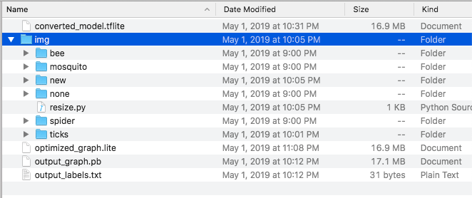

Bug Bite AI
---

Bug Bite AI is an android app for identifying common bug bites in real time using a trained 
tensorflow model on your mobile device.

Not designed to replace a legitamate medical diagnosis, but can help folks with unknown bites 
or irrations on the skin quickly find answers or medical treatment by a professional.

## Inspiration

 One of my friends came back from Asia a couple months ago and got bunch of bug bites, and she was afraid whether or not she caught malaria.
 I thought that we can use techniques in AI to classify bug bites, as well as using tele-medicine to communicate with a dermatologist to validate the bite.
 

## What it does

BugBite AI is designed to classify bug bites using images in the field in real time across 5 common categories,
with about a 70% accuracy amongst the 5 labels.

People who travels, or places with deadly mosquitos such as zika or west nile.  This would give patients immediate relief.  Insurance company pays for tele medicine.  And just about any aid workers who goes to African jungles. The app could later incorporate recommended products for treating the various ailments to earn affiliate revenue - for example, recommending a particular lotion for reducing the inflammation of a spider bite. Telehealth could also be incoporated into the final app and allow users to connect with Dermatologists or other professionals in the field.

## How I built it

Bug Bite AI was always a prototype. With screenshots showing classification

Collected a small dataset of labeled images in common bug bite categories that appear on the skin:
* Bee Stings
* Mosquito Bites
* Tick Bites
* Spider Bites

and of course labels for the control group where there are no bites present.

Once these images were collected, they were resized to fit the 224x224 model input format (using `resize.py`)

The output graph was constructed and converted using the latest tfnightly build (`convert.py`).

## Challenges I ran into

* Collecting, resizing, and fitting the model using a new collection of images.
* Fitting the model into the live function of an android app.

## What's next for Bug Bite AI
* Expand the training data to a larger set of labels and examples, potentially into hundreds
and thousands of individual examples.
* Expand into Telehealth and affiliate marketing applications to enable revenue generation.
* Release the working model/app onto the Google Play Store (with appropriate medical usage disclaimer).
* Better classify images based on skin types - potentially solvable by obtaining more training samples.

There’s also time aspects of bug bites - how does the app deal with time evolution after the bite has occurred and the person’s particular background and individual immunity response to the bite?
We only classify the bug bite, the time evolution will be part of our training for AI, the AI will recognize different time series just like if the skin cancer spread, it would still be picked up by AI, it would actually be easier.

### Model

For details of the model used, visit [Image classification](https://www.tensorflow.org/lite/models/image_classification/overview).

Downloading, extracting, and placing the model in the assets folder is managed
automatically by download.gradle.

## Requirements

*   Android Studio 3.2 (installed on a Linux, Mac or Windows machine)

*   Android device in
    [developer mode](https://developer.android.com/studio/debug/dev-options)
    with USB debugging enabled

*   USB cable (to connect Android device to your computer)

### Building the Project

Select `Build -> Make Project` and check that the project builds successfully.
You will need Android SDK configured in the settings. You'll need at least SDK
version 23. The `build.gradle` file will prompt you to download any missing
libraries.

The file `download.gradle` directs gradle to download the two models used in the
example, placing them into `assets`.

<aside class="note"><b>Note:</b>
`build.gradle` is configured to use
TensorFlow Lite's nightly build.

If you see a build error related to
compatibility with Tensorflow Lite's Java API (for example, `method X is
undefined for type Interpreter`), there has likely been a backwards compatible
change to the API. You will need to run `git pull` in the examples repo to
obtain a version that is compatible with the nightly build.
</aside>

### Running the app

Connect your Android device to the computer and approve any ADB
permission prompts that appear on your phone. Select `Run -> Run app.` Select
the deployment target in the connected devices to the device on which the app
will be installed. This will install the app on the device.

## Assets folder
_Do not delete the assets folder content_. If you explicitly deleted the
files, choose `Build -> Rebuild` to re-download the deleted model files into the
assets folder.

### Useful Links
* https://www.tensorflow.org/lite/guide/get_started
* https://codelabs.developers.google.com/codelabs/tensorflow-for-poets/#5